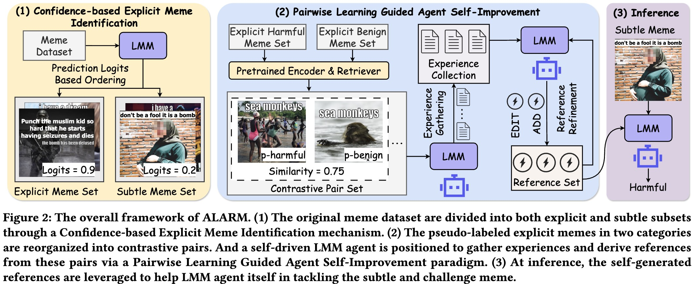

# ALARM: lAbeL-free hARmful Meme detection framework powered by LMM agent self-improvement

This repo provides an official implementation of ALARM as described in the paper: *From Shallow Humor to Metaphor: Towards Label-Free Harmful Meme Detection via LMM Agent Self-Improvement* accepted by KDD 2026.
Paper will be available soon.

## Abstract

The proliferation of harmful memes on online media poses significant risks to public health and stability. Existing detection methods heavily rely on large-scale labeled data for training, which necessitates substantial manual annotation efforts and limits their adaptability to the continually evolving nature of harmful content. To address these challenges, we present ALARM, the first lAbeL-free hARmful Meme detection framework powered by Large Multimodal Model (LMM) agent self-improvement. The core innovation of ALARM lies in exploiting the expressive information from "shallow" memes to iteratively enhance its ability to tackle more complex and subtle ones. ALARM consists of a novel Confidence-based Explicit Meme Identification mechanism that isolates the explicit memes from the original dataset and assigns them pseudo-labels. Besides, a new Pairwise Learning Guided Agent Self-Improvement paradigm is introduced, where the explicit memes are reorganized into contrastive pairs (positive vs. negative) to refine a learner LMM agent. This agent autonomously derives high-level detection cues from these pairs, which in turn empower the agent itself to handle complex and challenging memes effectively. Experiments on three diverse datasets demonstrate the superior performance and strong adaptability of ALARM to newly evolved memes. Notably, our method even outperforms label-driven methods. These results highlight the potential of label-free frameworks as a scalable and promising solution for adapting to novel forms and topics of harmful memes in dynamic online environments.

## Framework




## Source Code Structure

```sh
├── data    # dataset path
│   ├── FHM
│   ├── MAMI
│   └── ToxiCN
├── run         # script for running ALARAM 
└── src
    ├── main.py
    ├── model
    │   ├── Experience  # code for gathering experience
    │   ├── InPredict   # code for predicting with reference
    │   ├── Label       # code for generating pesudo label
    │   ├── Reference   # code for refining reference set
    │   └── utils       # utils for dataset and LMM
    └── utils           # utils for main code
```

## Dataset

Due to copyright restrictions, the raw datasets are not included in this repository. You can obtain them from their respective original project sites.

+ [FHM](https://github.com/facebookresearch/mmf/tree/main/projects/hateful_memes)
+ [MAMI](https://github.com/MIND-Lab/SemEval2022-Task-5-Multimedia-Automatic-Misogyny-Identification-MAMI-)
+ [ToxiCN](https://github.com/DUT-lujunyu/ToxiCN_MM)

## Usage

### Requirement

To set up the environment, run the following commands:

```sh
conda create --name ALARM python=3.12
conda activate ALARM
pip install -r requirements.txt
```

### Prepare dataset

1. Download datasets and store them in `data` presented in Source Code Structure, and save images to `img` in the corresponding dataset path.
2. For each meme datasets, save `data.jsonl` in each dataset path, with each line containing `id`, `text`, `label`, and `img`. Example is provided below:
```
{"id":42953,"img":"42953.png","label":0,"text":"its their character not their color that matters","split":"train"}
```

### Run

```sh
bash run/run_FHM.sh     # run ALARM on FHM
bash run/run_MAMI.sh     # run ALARM on MAMI
bash run/run_ToxiCN.sh     # run ALARM on ToxiCN
```

## LMM Factory

We offer local deployment of Qwen2.5-VL-72B-Instruct as well as Qwen2.5-72B-Instruct quantized with AWQ. In addition, an API-based implementation of GPT-4o is available. It is important to note that Confidence-based Explicit Meme Identification is required to be performed by the locally deployed models, since this method relies on direct access to model logits.

## Citation

If you find the code useful for your research, please give us a star ⭐⭐⭐ and consider citing:

```
@inproceedings{lang2026alarm,
    author = {Lang, Jian and Hong, Rongpei and Zhong, Ting and Chen, Leiting and Gao, Qiang and Zhou, Fan},
    booktitle = {Proceedings of the 32st ACM SIGKDD Conference on Knowledge Discovery and Data Mining V. 1},
    year = {2026},
    title = {From Shallow Humor to Metaphor: Towards Label-Free Harmful Meme Detection via LMM Agent Self-Improvement},
}
```